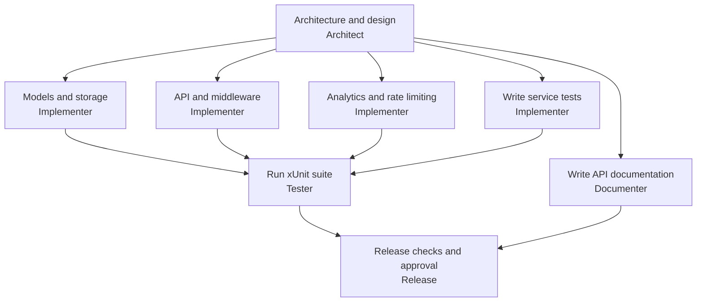
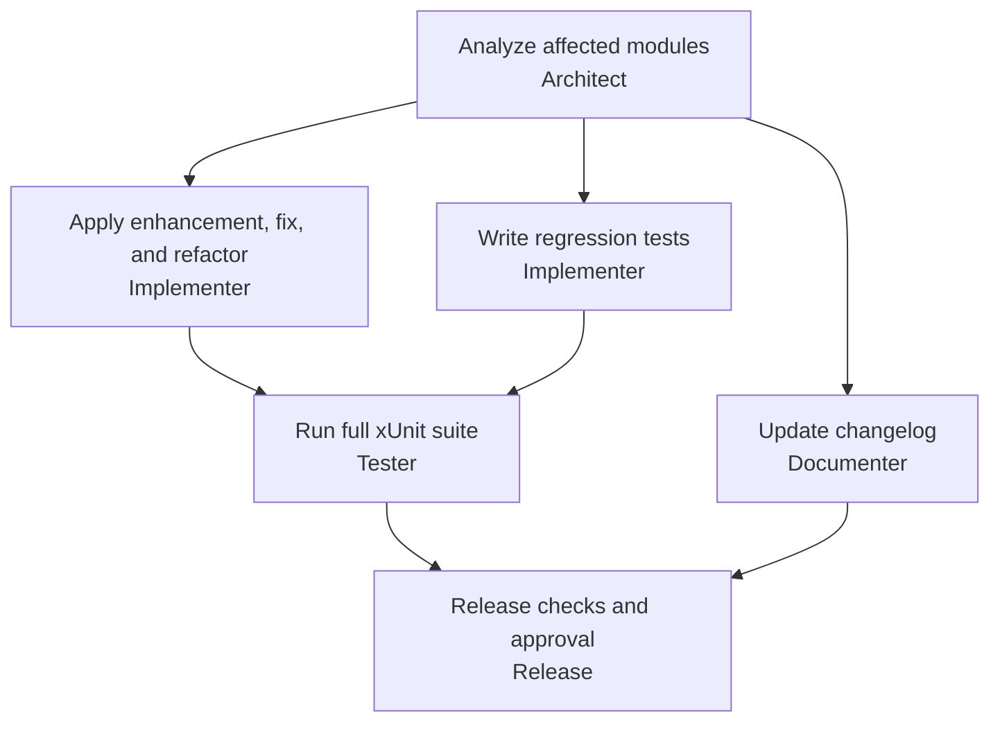
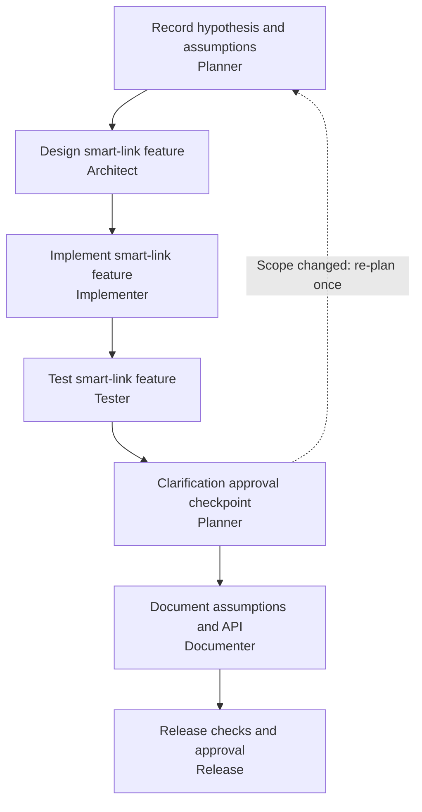

# Agentic Software Engineering System — URL Shortener (.NET 10)

A **URL shortener service** and a **deterministic, template-based SDLC
orchestration framework**, implemented in **C# on .NET 10** with
**ASP.NET Core**.
The repo is two things in one:

1. **`src/Service/`** — an ASP.NET Core URL shortener (create, redirect,
   analytics, idempotency, rate limiting, custom aliases, expiry).
2. **`src/Orchestrator/` + `src/Agents/` + `src/Scenarios/`** — an agent
   orchestration engine that planned, designed, implemented, tested,
   documented, and released the service across **three verified scenario
   runs** (greenfield, brownfield, ambiguous), with DAG scheduling, gates,
   human approvals, policy guardrails, retries, audit logging, metrics,
   and dynamic re-planning.

The scenario-generated service code comes from a **single source of truth**
(`src/Agents/Codegen.cs`), so the product and the agent-generated code can
never drift apart. See [docs/ARCHITECTURE.md](docs/ARCHITECTURE.md).

## Prerequisites

- .NET SDK **10.x** (verify with `dotnet --version`).
- PowerShell or a Unix-like shell. No external services — SQLite via
  `Microsoft.Data.Sqlite`, no Docker, no network needed at runtime.

```bash
export PATH=$HOME/workspace/.dotnet:$PATH
export DOTNET_CLI_TELEMETRY_OPTOUT=1
export DOTNET_SKIP_FIRST_TIME_EXPERIENCE=1
```

Pinned versions: `Microsoft.Data.Sqlite` **10.0.7** (+ `SQLitePCLRaw.lib.e_sqlite3`
**2.1.13** pin for the NU1903 advisory), xUnit **2.9.2** /
test SDK **17.11.1**, `Microsoft.AspNetCore.Mvc.Testing` **10.0.0**.
All projects target `net10.0`.

## Running the tests

```bash
# from the repo root
dotnet test AgenticUrlShortener.sln --nologo -v q
```

153/153 passing: 96 service cases + 57 orchestrator/agent cases. Generated
scenario workspaces under `runs/*/workspace/` are ordinary directories
(not in the solution), so their own suites are never collected by the
repo test run. Details in [docs/TESTING.md](docs/TESTING.md).

## Running the service

Management endpoints now require an API key. See [API access and migration](docs/API_ACCESS.md)
for PowerShell setup, Visual Studio debugging, and upgrading an existing database.
Configure `SHORTENER_API_KEYS` before starting the service.

```bash
SHORTENER_DB=/tmp/demo.db \
ASPNETCORE_URLS=http://127.0.0.1:8000 \
dotnet src/Service/bin/Debug/net10.0/AgenticUrlShortener.Service.dll
# (build first: dotnet build AgenticUrlShortener.sln --nologo -v q)
```

### Swagger UI

In Development, open [Swagger UI](https://localhost:7084/swagger) with the HTTPS
launch profile, or `http://localhost:5038/swagger` with the HTTP profile.
The application root `/` redirects to Swagger UI in Development.

1. Configure `SHORTENER_API_KEYS` using the [API access setup](docs/API_ACCESS.md),
   then start or restart the service.
2. Click **Authorize**, paste your API key without a `Bearer` prefix, and click
   **Authorize** in the dialog. The UI sends it as `X-Api-Key` for management calls.
3. Expand an endpoint, choose **Try it out**, provide its inputs, and click
   **Execute**. For `POST /api/urls`, use a valid destination, for example:

   ```json
   { "url": "https://example.com", "expires_in_days": 7 }
   ```

Swagger UI does not configure server credentials: management calls still return
503 if `SHORTENER_API_KEYS` is missing, or 401 if the supplied key is invalid.
Health checks and redirects are public. Authorization is not persisted across
page reloads. The OpenAPI document is available at `/swagger/v1/swagger.json`.
Swagger UI and the document are disabled outside Development. Documentation uses
[Swashbuckle.AspNetCore](https://github.com/domaindrivendev/Swashbuckle.AspNetCore)
10.2.3 and is included in generated scenario services as well.

### Configuration

| Variable | Default | Purpose |
|---|---|---|
| `SHORTENER_API_KEYS` | (empty; management returns 503) | JSON object mapping stable owner IDs to secret API keys |
| `SHORTENER_DB` | `shortener.db` | SQLite file path (`:memory:` in tests) |
| `SHORTENER_BASE_URL` | `http://localhost:8000` | Base URL used in generated `short_url` fields |
| `SHORTENER_RATE_PER_MINUTE` | `60` | Token-bucket refill rate per IP |
| `SHORTENER_RATE_BURST` | `10` | Token-bucket burst per IP |
| `SHORTENER_TRUSTED_PROXIES` | (empty) | Comma-separated proxy IP addresses allowed to supply `X-Forwarded-For` |
| `ASPNETCORE_URLS` | (SDK default) | Bind address, e.g. `http://127.0.0.1:8000` |

### API endpoints

All `/api/*` requests require `X-Api-Key`. Management and analytics are scoped to
the authenticated owner; other owners' codes return `404`. Redirects and probes
remain public. Existing links remain redirectable but unowned after migration.

| Method | Path | Notes |
|---|---|---|
| `POST` | `/api/urls` | Create short URL → `201`; `Idempotency-Key` header replays → `200` same body |
| `GET` | `/api/urls` | List the caller's short URLs |
| `GET` | `/api/urls/{code}` | Fetch one |
| `DELETE` | `/api/urls/{code}` | Delete → `204` |
| `GET` | `/api/urls/{code}/stats` | Click analytics: totals, per-day, referrer/UA breakdown, `last_clicked_at` |
| `GET` | `/{code}` | `307` redirect, records timestamp/referrer/user-agent/IP |
| `GET` | `/health` | Liveness (bypasses rate limiter) |
| `GET` | `/ready` | Readiness — performs a DB check, returns `db: ok\|error` |

POST accepts `{"url": "...", "custom_alias": "...", "expires_in_days": N}`.
When supplied, `expires_in_days` must be between 1 and 3650 inclusive;
values outside that range return `422`. Expiry comparisons use UTC instants.
Generated codes are 7 alphanumeric characters; aliases must be 3–32 chars
of `[A-Za-z0-9_-]`. Conflicting aliases → `409`; invalid destination →
`422`; expired links → `410` (v1 incorrectly returned `404` — the planted
bug fixed in the brownfield run). The catch-all `/{code}` route is
registered **last** so it never shadows `/health`, `/ready`, or `/api/*`.
Per-IP token-bucket rate limiting returns `429` + `Retry-After`. All JSON
is snake_case.

Unhandled request failures use centralized exception handling with safe Problem
Details responses and correlation IDs. See [Error handling](docs/ERROR_HANDLING.md)
for status mappings and how to locate the corresponding server log.

Forwarded IP headers are ignored by default. When using a reverse proxy, set
`SHORTENER_TRUSTED_PROXIES` to its immediate peer IP address. The service consumes
one forwarded hop, from the right of the header; the proxy must append or replace
the client IP. The validated IP is used for both rate limiting and click analytics.
Aliases `api`, `health`, `ready` and `swagger` are reserved, regardless of case. Concurrent
creates with the same owner, idempotency key, and validated request return one
saved response and create one URL. Changed requests return `422`; replay records
expire after 24 hours.

`/ready` performs a bounded database query and returns `503` with
`{"status":"degraded","db":"error"}` when storage cannot be queried.
`/health` remains a separate liveness check.

### Demo sequence

```bash
B=http://127.0.0.1:8000
# Set SHORTENER_KEY to the key configured for this caller.
# create — custom alias -> 201 Created
curl -X POST $B/api/urls -H "X-Api-Key: $SHORTENER_KEY" -H 'Content-Type: application/json' \
  -d '{"url":"https://example.com/docs","custom_alias":"demo-link"}'

# redirect -> 307 Temporary Redirect + location: https://example.com/docs
curl -D - $B/demo-link

# analytics -> {"total_clicks": 1, "clicks_by_day": [...], ...}
curl $B/api/urls/demo-link/stats -H "X-Api-Key: $SHORTENER_KEY"

# idempotent replay -> 201 then 200 with the identical body
curl -X POST $B/api/urls -H "X-Api-Key: $SHORTENER_KEY" -H 'Content-Type: application/json' \
  -H 'Idempotency-Key: abc123' -d '{"url":"https://example.com/docs"}'
curl -X POST $B/api/urls -H "X-Api-Key: $SHORTENER_KEY" -H 'Content-Type: application/json' \
  -H 'Idempotency-Key: abc123' -d '{"url":"https://example.com/docs"}'

# expired link -> 410 ; unknown code -> 404 ; alias conflict -> 409
curl -o /dev/null -s -w '%{http_code}\n' $B/<expired-code>

curl $B/health $B/ready
```

## Running the scenarios

Each scenario runs the full agentic SDLC and emits a run bundle
(`audit.jsonl`, `metrics.json`, `decision_lineage.md`, `manifest.json`).
From the repo root:

```bash
dotnet run --project src/Scenarios -- greenfield --auto   # build v1 from scratch
dotnet run --project src/Scenarios -- brownfield --auto    # evolve v1 -> v2 (aliases, 410 fix)
dotnet run --project src/Scenarios -- ambiguous --auto     # vague request -> clarify -> re-plan
```

`--auto` auto-approves human checkpoints (approval decisions are still
recorded in the audit log). Run bundles land in
`runs/<scenario>/<run-id>/`. Details in
[docs/FINAL_SUMMARY.md](docs/FINAL_SUMMARY.md).

### Scenario workflows

These diagrams follow the task dependencies defined in
[PlannerAgent.cs](src/Agents/PlannerAgent.cs). Before each workflow, the planner
analyzes and normalizes the requirement and creates the scenario's task plan.
The orchestration engine then executes that plan.

Solid arrows mean a task must finish before the next task can run. Separate
branches can run in parallel when their entry gates pass. Labels show the work
and the responsible agent. Release requires passing tests, documentation, no
policy violations, a rollback plan, and approval; it does not deploy to production.

#### Greenfield: build v1 from scratch

Architecture comes first. Implementation, test writing, and documentation can
then proceed in parallel. Test execution waits for all implementation branches
and the test suite; release also waits for documentation.



#### Brownfield: enhance an existing v1 service

The scenario first materializes a v1 baseline. Impact analysis identifies the
affected modules, then implementation, regression-test writing, and changelog
updates can proceed in parallel. The v2 changes add aliases, fix expired-link
responses from 404 to 410, and extract shared validators.



#### Ambiguous: clarify the scope and re-plan

Starting from a v2 baseline, the planner records assumptions about "make short
links smarter." Design, implementation, and tests initially use that hypothesis.
An approval checkpoint then applies a predefined simulated stakeholder
clarification, which changes the scope and queues a re-plan.



The dotted arrow represents an engine re-plan request, not a dependency edge in
the task DAG. The engine invalidates `clarify` and its downstream tasks and runs
them again. On that second pass, the planner preserves the confirmed requirement
and skips reinjecting clarification, allowing documentation and release to finish.

## Repository layout

```
agentic-url-shortener-dotnet/
├── AgenticUrlShortener.sln
├── src/
│   ├── Service/        # ASP.NET Core URL shortener (shipped product)
│   ├── Orchestrator/   # DAG engine: waves, gates, approvals, policies,
│   │                   # retries/rollback, audit, metrics, re-planning
│   ├── Agents/         # Planner, Architect, Implementer, Tester,
│   │                   # Documenter, Release + Codegen (single source of truth)
│   └── Scenarios/      # greenfield / brownfield / ambiguous CLI runners
├── tests/
│   ├── Service.Tests/      # 96 service cases (API, storage, security, Swagger)
│   └── Orchestrator.Tests/ # 57 orchestrator/agent cases (xUnit)
├── docs/               # ARCHITECTURE.md, TESTING.md, FINAL_SUMMARY.md
└── runs/               # scenario run bundles + BUILD_LOG.md
```

## Limitations

- The agents execute C# rules and reviewed code templates; they do not call an LLM.
- Task deadlines signal cooperative cancellation. Built-in agents check it before
  writes, and the tester kills and joins its subprocess tree. The engine retains
  the worker slot until execution exits, then records failure and compensates;
  late completion cannot turn a timeout into success. Custom agents and blocking
  approval overrides must honor cancellation; in-process code cannot be forcibly
  terminated safely. Redirected console input may wait until its reader returns.
- Shared context reads return snapshots. Use `Put`, `Update`, `AppendToList`, or
  `Take` to publish changes atomically. Custom mutable objects stored in context
  must provide their own synchronization.
- The Tester agent resolves `dotnet` from `DOTNET_BIN`, then
  `~/workspace/.dotnet/dotnet`, then `dotnet` on `PATH`; scenario runs
  require one of those to exist.
- Scenario workspaces materialize generated projects under
  `runs/<scenario>/<run-id>/workspace/src/`; they are intentionally not
  part of the solution, so `dotnet test` at the repo root never collects
  them.
- The in-memory per-IP rate limiter does not survive restarts and is not
  shared across instances.
- Human-approval checkpoints are simulated by `--auto` in unattended
  runs; every auto-approval is recorded in `audit.jsonl` like a real one.
